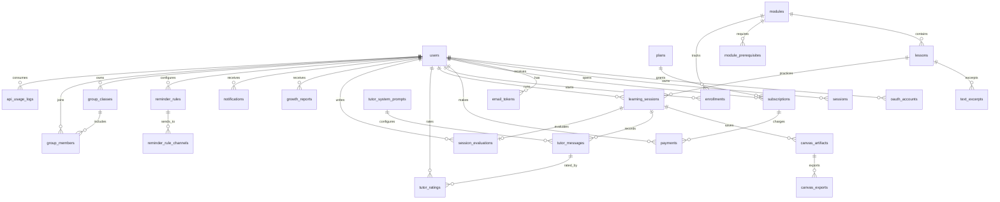

# Brain180 v2 Data Model

This document is the database handoff for the Brain180 v2 HOW track. It is based on
`docs/architecture-v2.md` section 3 and the screen/flow nodes in `docs/system-v2.json`.

## Scope

- Database: PostgreSQL
- ORM: Drizzle ORM
- Primary keys: UUID v7 via `uuid_v7()`
- Time storage: `timestamptz`, stored in UTC by the application boundary
- Soft deletion: user-owned operational data only
- Hard deletion: log-style data with independent retention windows
- Large append-only candidates: `tutor_messages`, `api_usage_logs`

The Drizzle schema is in `server/db/schema.ts`; the initial migration is
`server/db/migrations/0001_init.sql`.

## Entity Groups

### Identity

- `users`: student/admin identity, profile fields, email verification state, soft delete
- `oauth_accounts`: Google/Kakao provider identity mapping
- `sessions`: Lucia-compatible server sessions
- `email_tokens`: email verification and password reset tokens

### Billing

- `plans`: free/standard/premium feature bundles
- `subscriptions`: user plan state, Toss billing key, soft delete
- `payments`: payment attempts, plan snapshot, currency, and paid/refunded state

### Content

- `modules`: 3-axis curriculum modules
- `module_prerequisites`: normalized prerequisite graph
- `lessons`: ordered learning content under a module
- `text_excerpts`: excerpts and highlights used by text/canvas practice

### Learning Core

- `enrollments`: user progress per module
- `learning_sessions`: lesson session in analyze/reverse/practice mode, with KPI perspective snapshot
- `canvas_artifacts`: saved canvas state in free/constrained/guided mode
- `canvas_exports`: PDF/PNG exports for saved artifacts

### AI Tutor

- `tutor_system_prompts`: versioned active/inactive tutor prompts
- `tutor_messages`: append-only tutor chat history, with KPI telemetry snapshots
- `tutor_ratings`: user star/comment feedback on tutor messages

### Assessment And Reports

- `session_evaluations`: end-of-session self/system evaluation and graph complexity metrics
- `growth_reports`: period reports, 3-axis scores, anonymization support

### Notification And Admin

- `notifications`: user notification center
- `reminder_rules`: daily/weekly reminder rules
- `reminder_rule_channels`: normalized push/email channel list
- `group_classes`: admin-owned cohorts/classes
- `group_members`: class membership
- `api_usage_logs`: AI token and cost telemetry
- `api_costs`: provider-level API cost ledger for revenue/cost KPI reporting

## KPI Mapping

ALI-65 KPI SQL uses shorter analytics names. The production schema keeps the v2 domain names and maps
those KPI assumptions as follows:

| KPI name | Schema table | Notes |
|---|---|---|
| `sessions` | `learning_sessions` | `text_id` maps to `lesson_id`; `perspective` is a denormalized module-axis snapshot. |
| `evaluations` | `session_evaluations` | `score`, `node_count`, `edge_count`, and `created_at` support system-evaluation KPI queries. |
| `chat_messages` | `tutor_messages` | `tokens`, `latency_ms`, `rating`, `rejected`, and `prompt_version` support tutor KPI queries. |
| `payments.plan` | `payments.plan_name` | Stored as a plan snapshot so monthly conversion/MRR queries do not depend on subscription joins. |
| `api_costs` | `api_costs` | New provider-level cost table for API cost/revenue ratio. |

## ERD

Note: `tutor_messages.prompt_version` is a lightweight KPI/A-B snapshot, not a prompt foreign key.
Add a direct `prompt_id` later if the runtime needs exact prompt lineage per message.

## Index Strategy

### Identity And Auth

- `users_email_idx` is unique for login and email verification.
- `users_created_at_idx` supports signup trends and retention cohorts.
- `users_verified_at_idx` supports email verification-rate analytics.
- `users_role_idx` supports admin/student filtering.
- `sessions_user_id_idx` and `sessions_expires_at_idx` support auth lookup and cleanup.
- `email_tokens_user_purpose_idx` supports active token lookup per purpose.
- `email_tokens_expires_at_idx` supports scheduled expiration cleanup.

### Billing

- `plans_name_idx` is unique for `free`, `standard`, `premium`.
- `subscriptions_user_status_idx` supports current plan lookup.
- `payments_user_id_idx` supports user payment history and conversion joins.
- `payments_user_paid_at_idx` supports billing history screens.
- `payments_status_created_idx` supports payment success-rate and MRR queries.
- `payments_plan_name_idx` supports plan-level conversion and MRR grouping.
- `payments_toss_payment_key_idx` prevents duplicate Toss webhook processing.

### Content And Learning

- `modules_axis_order_idx` keeps each axis ordered and unique.
- `lessons_module_order_idx` keeps lesson order stable per module.
- `module_prerequisites_prerequisite_idx` supports reverse dependency checks.
- `enrollments_module_status_idx` supports admin progress dashboards.
- `learning_sessions_started_at_idx` supports DAU/WAU grouping.
- `learning_sessions_user_started_idx` supports timeline and recent activity views.
- `learning_sessions_lesson_mode_idx` supports lesson-level usage analysis.
- `learning_sessions_lesson_id_idx` supports completion-rate grouping by lesson/text.
- `learning_sessions_perspective_idx` supports 3-axis KPI grouping.
- `canvas_artifacts_session_saved_idx` and `canvas_exports_artifact_format_idx` support gallery/export flows.

### AI, Reports, Admin

- `tutor_messages_session_created_idx` supports chat history replay.
- `tutor_messages_role_created_idx` supports admin review by role.
- `tutor_messages_prompt_version_idx` supports prompt-version comparison.
- `tutor_messages_assistant_latency_idx` is a partial index for assistant-only latency percentiles.
- `tutor_messages_assistant_rejected_idx` is a partial index for assistant-only rejection-rate checks.
- `tutor_ratings_message_user_idx` prevents duplicate rating by the same user.
- `session_evaluations_session_idx` enforces one evaluation per session.
- `session_evaluations_score_idx` supports score distribution queries.
- `session_evaluations_created_at_idx` supports time-bucketed evaluation analytics.
- `growth_reports_user_period_idx` supports period report lookup.
- `notifications_user_read_idx` supports unread filtering.
- `reminder_rules_user_active_idx` supports reminder worker scans.
- `api_usage_logs_user_ts_idx` and `api_usage_logs_model_ts_idx` support token/cost reporting.
- `api_costs_recorded_at_idx` supports monthly API cost aggregation.
- `api_costs_provider_recorded_at_idx` supports provider-level cost trends.

## Retention And Deletion Policy

### Soft Deleted User Data

Use `deleted_at` for data that a user can reasonably expect to restore or export:

- `users`
- `subscriptions`
- `enrollments`
- `learning_sessions`
- `canvas_artifacts`
- `notifications`
- `reminder_rules`
- `group_classes`

Application queries should filter `deleted_at IS NULL` by default. Admin exports may include deleted
rows only when explicitly requested.

### Hard Deleted Or Expiring Data

Use hard deletion for short-lived or log-style data:

- `sessions`: delete after `expires_at`
- `email_tokens`: delete after expiration or successful consumption
- `api_usage_logs`: keep 18 months by default, then aggregate and delete raw rows
- `api_costs`: keep 36 months by default; monthly aggregates may be retained permanently
- `tutor_messages`: keep 24 months by default unless a user deletion/anonymization request applies
- `canvas_exports`: delete when backing object storage is deleted or when the parent artifact is deleted

### Growth Report Anonymization

`growth_reports` supports anonymization without deleting aggregate learning value:

- `user_id` can be set to null by FK behavior or an anonymization job.
- `is_anonymized` marks reports safe for aggregate analytics.
- `anonymized_at` records when the identifying link was removed.

### Partitioning Candidates

The initial migration creates regular tables. For production scale, convert the following to monthly
range partitions before high-volume launch:

- `tutor_messages`, partition key: `created_at`
- `api_usage_logs`, partition key: `ts`
- `api_costs`, partition key: `recorded_at` if provider cost imports become high volume

Recommended partition naming:

- `tutor_messages_YYYY_MM`
- `api_usage_logs_YYYY_MM`
- `api_costs_YYYY_MM`

Keep global query APIs behind repository functions so partition conversion does not leak into route
handlers.

## Integrity Rules

- `users.age` must be null or between 0 and 120.
- `enrollments.progress` must be between 0 and 100.
- `module_prerequisites` disallows a module requiring itself.
- `tutor_ratings.stars` must be between 1 and 5.
- `tutor_messages.rating` must be null or between 1 and 5.
- `tutor_messages.latency_ms` must be null or non-negative.
- `session_evaluations.self_score` must be between 1 and 5.
- `session_evaluations.score` must be null or between 0 and 100.
- `session_evaluations.node_count` and `edge_count` must be null or non-negative.
- `growth_reports` scores must be between 0 and 100.
- `growth_reports.period_start` must be on or before `period_end`.
- `api_costs.tokens_used` must be null or non-negative.
