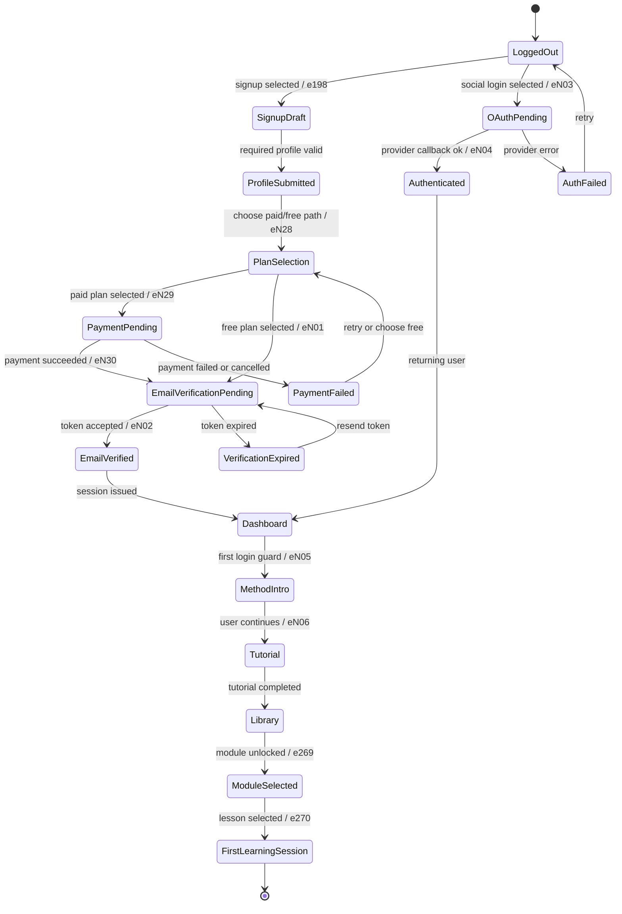
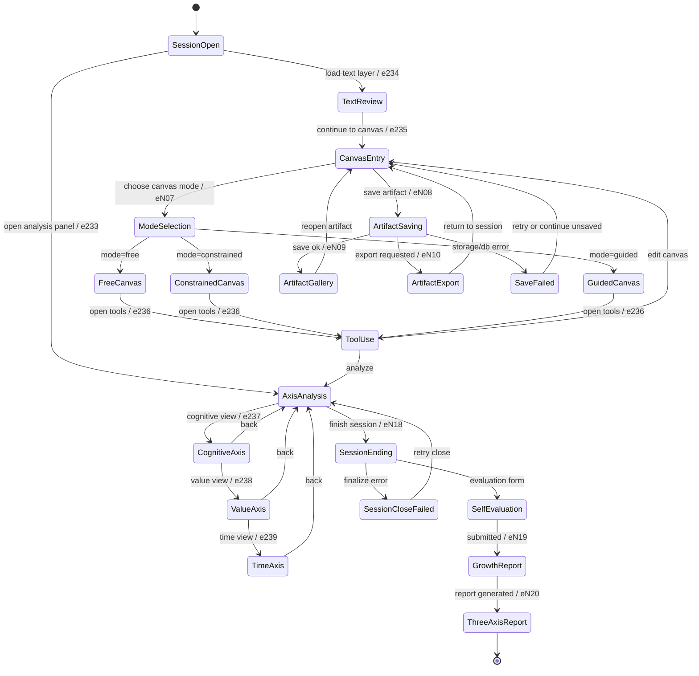
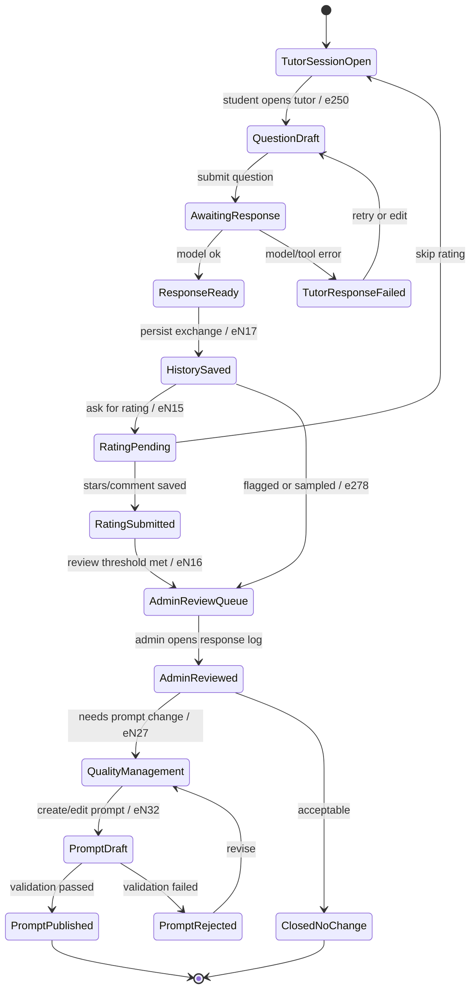
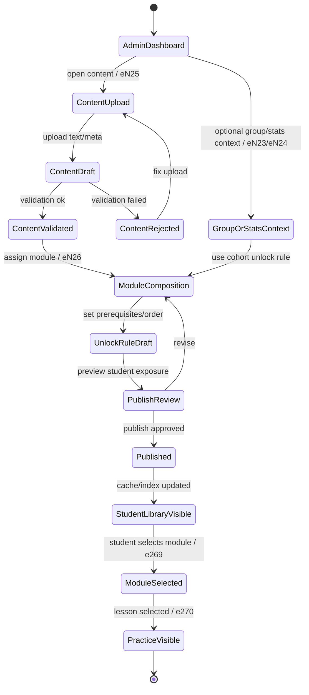
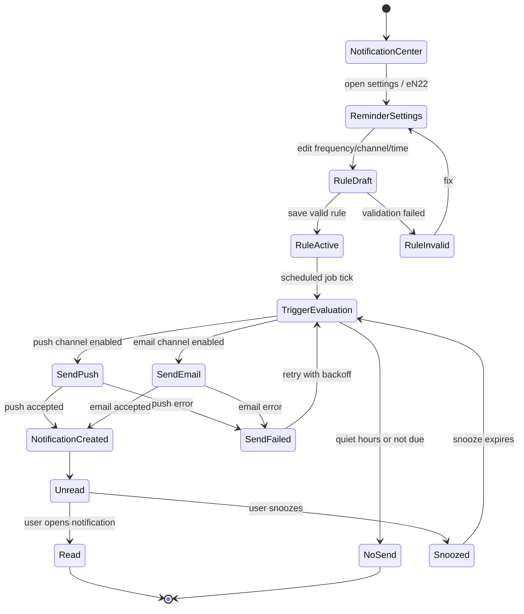

# Brain180 v2 - State Machines

> Owner: 류한길 [워크플로]  
> Issue: ALI-63  
> Inputs: `docs/architecture-v2.md` section 4, `docs/system-v2.json` edges eN01-eN32 and e207-e283  
> Purpose: route implementation, background jobs, AI tutor prompt cycle, and QA scenario baselines.

## 0. 공통 규칙

- 모든 상태 전이는 서버 API 성공을 기준으로 확정한다. UI 이동만으로 상태를 완료 처리하지 않는다.
- 각 상태는 `actor`, `route/node`, `allowed transitions`, `guard`, `side effect`, `failure/rollback`을 가진다.
- `draft` 상태는 클라이언트 local state 또는 DB 임시 row로 유지할 수 있지만, 결제/인증/출판/발송처럼 외부 시스템이 걸린 상태는 서버가 canonical source다.
- 실패 상태는 사용자가 재시도할 수 있어야 하며, 외부 side effect가 이미 발생한 경우 idempotency key로 중복 처리를 막는다.
- `role=admin` 전이는 서버 미들웨어에서 한 번 더 검사한다. 클라이언트 라우팅 guard만 믿지 않는다.

## 1. Signup to First Learning

범위: 가입 -> 이메일 인증 -> 플랜 선택 -> 결제 -> 온보딩 -> 첫 학습.  
주요 노드/엣지: n181, n193, n300, n320, n321, n301, n303, n302, n205, n213, n268, n225 / e198, eN01-eN06, eN28-eN30, e251, e269, e270.

| State | Actor | Route / Node | Allowed transitions | Guard condition | Side effect | Failure / rollback |
|---|---|---|---|---|---|---|
| LoggedOut | Student | `/login` n181 | SignupDraft, OAuthPending | No valid session | None | OAuth failure returns here with safe error |
| SignupDraft | Student | `/signup` n193 | ProfileSubmitted, LoggedOut | Email format, password policy, required profile fields | Create or update unverified `User` draft | Validation error keeps draft; no session issued |
| ProfileSubmitted | Server | n182, n201, n202, n203, n204 / e207-e210 | PlanSelection, EmailVerificationPending | Profile fields complete | Persist profile attributes | On DB error keep user on signup and do not send token |
| PlanSelection | Student | `/signup/plan` n320 | PaymentPending, EmailVerificationPending | Plan exists and is active | Reserve selected plan in pending subscription | Invalid plan returns to PlanSelection |
| PaymentPending | Student, Toss | `/signup/pay` n321 | EmailVerificationPending, PaymentFailed | Idempotency key, pending subscription, Toss signature on webhook | Create `Payment`, activate or mark `Subscription` pending verification | Cancelled payment voids pending payment only; user/profile retained |
| EmailVerificationPending | Student, Resend | `/signup/email-verify` n300 | EmailVerified, VerificationExpired | Token exists, purpose=`verify`, not expired | Send verification email; on success set `emailVerifiedAt` | Expired token can be regenerated; payment/subscription remains pending |
| EmailVerified | Server | n300 -> n205 / eN02 | Dashboard | Verified email and active or free subscription | Issue session, mark onboardingRequired if first login | If session issue fails, user can login with verified account |
| OAuthPending | Student, OAuth provider | `/oauth/{google|kakao}` n301 | Authenticated, AuthFailed | Provider state and callback valid | Upsert OAuth account, issue session | Provider error leaves no partial privileged session |
| Dashboard | Student | `/dashboard` n205 | MethodIntro, Library | Authenticated | Fetch enrollment/progress summary | API failure shows dashboard error; no state mutation |
| MethodIntro | Student | `/onboarding/intro` n303 | Tutorial | First login or onboardingRequired | Record intro viewed timestamp | User can resume from same step |
| Tutorial | Student | `/onboarding/tutorial` n302 | Library | Intro viewed or skipped by admin policy | Mark onboarding completed | Failure leaves onboardingRequired=true |
| Library | Student | `/library` n213 | ModuleSelected | Authenticated, email verified | Fetch modules and unlock status | Locked/empty state blocks lesson start |
| ModuleSelected | Student | `/library/:moduleId` n268 | FirstLearningSession | Enrollment exists or can be created; module unlocked | Create/update `Enrollment` | If module locked, stay in Library with reason |
| FirstLearningSession | Student | `/practice/:lessonId` n225 | End | Lesson belongs to unlocked module | Create `LearningSession.startedAt` | On creation failure return to ModuleSelected |

## 2. Learning Session

범위: 텍스트 -> 캔버스 모드 선택(자유/제약/단계) -> 도구 -> 3축 분석 -> 세션 종료 -> 자가 평가.  
주요 노드/엣지: n225, n228, n229, n230, n304, n305, n306, n322, n227, n226, n231, n232, n310, n311, n312 / e233-e239, eN07-eN13, eN18-eN20.

| State | Actor | Route / Node | Allowed transitions | Guard condition | Side effect | Failure / rollback |
|---|---|---|---|---|---|---|
| SessionOpen | Student | `/practice/:lessonId` n225 | TextReview, AxisAnalysis, SessionEnding | Authenticated, lesson unlocked, active `LearningSession` exists | Load text, latest artifact, progress | If session cannot load, return to module page |
| TextReview | Student | text panel n228 | CanvasEntry, SessionOpen | Text excerpt exists | Record text opened event | Missing text blocks session and logs content error |
| CanvasEntry | Student | canvas panel n229 | ModeSelection, ArtifactSaving, ToolUse, AxisAnalysis | Session active | Load canvas payload from draft or last artifact | Corrupt payload opens blank canvas with recover option |
| ModeSelection | Student | `/practice/:lessonId/canvas/mode` n304 | FreeCanvas, ConstrainedCanvas, GuidedCanvas | Mode in `free|constrained|guided` | Set session canvas mode; resolves old assumptions n262/n263/n274 via eN11-eN13 | Invalid mode returns to CanvasEntry |
| FreeCanvas | Student | n304 mode=free | ToolUse, CanvasEntry | No imposed template required | Persist draft strokes/nodes locally and periodically | Draft save failure warns but does not close session |
| ConstrainedCanvas | Student | n304 mode=constrained | ToolUse, CanvasEntry | Constraint template exists for lesson | Load required slots/rules | Missing template rolls back to ModeSelection |
| GuidedCanvas | Student | n304 mode=guided | ToolUse, CanvasEntry | Guided steps configured | Track current step and completion | Step validation failure keeps current step |
| ToolUse | Student | tools panel n230 | CanvasEntry, AxisAnalysis | Session active | Apply selected tool, update canvas draft | Tool error reverts only the last tool operation |
| ArtifactSaving | Student, Server, R2 | n305 | ArtifactGallery, ArtifactExport, SaveFailed | Canvas payload serializable, session active | Upsert `CanvasArtifact`, upload thumbnail/export source | DB save failure aborts R2 reference; orphan R2 cleanup job removes partial upload |
| ArtifactGallery | Student | `/artifacts` n306 | CanvasEntry | Artifact belongs to user | Fetch artifact list | Missing artifact returns 404 and no mutation |
| ArtifactExport | Student, R2 | `/artifacts/:id/export` n322 | CanvasEntry | Artifact owned by user, format allowed | Create `CanvasExport`, upload PDF/PNG | Export failure keeps source artifact intact |
| AxisAnalysis | Student, Analyzer | analysis panel n227 | CognitiveAxis, ValueAxis, TimeAxis, SessionEnding | Text and canvas draft available, or analysis can run with partial context | Run or load 3-axis analysis | Analyzer failure leaves manual reflection path available |
| CognitiveAxis | Student | n226 | ValueAxis, AxisAnalysis | Analysis result has cognitive score or pending state | Show cognitive structure feedback | Missing score shows pending and can retry analyzer |
| ValueAxis | Student | n231 | TimeAxis, AxisAnalysis | Analysis result has value score or pending state | Show value interpretation feedback | Same as above |
| TimeAxis | Student | n232 | AxisAnalysis, SessionEnding | Analysis result has time score or pending state | Show time-axis feedback | Same as above |
| SessionEnding | Student, Server | n310 entry / eN18 | SelfEvaluation, SessionCloseFailed | Session active; unsaved canvas warning acknowledged | Set `LearningSession.endedAt`, snapshot final artifact reference | If close fails, keep session active and retry |
| SelfEvaluation | Student | `/assessment/:sessionId` n310 | GrowthReport | Session belongs to user and endedAt set | Create `SessionEvaluation` | Validation error keeps form draft |
| GrowthReport | Server | `/reports/growth` n311 | ThreeAxisReport | Evaluation exists | Recompute `GrowthReport` aggregate | Report failure queues retry; evaluation remains saved |
| ThreeAxisReport | Student | `/reports/three-axis` n312 | End | Growth report exists or pending | Display 3-axis summary | Pending state allows reload |

## 3. AI Tutor Conversation and Prompt Improvement

범위: 질문 -> 응답 -> 품질 평가(별점/코멘트) -> 관리자 검토 -> 프롬프트 개선.  
주요 노드/엣지: n241, n195, n191, n309, n308, n256, n319, n307 / e250, e278, e283, eN15-eN17, eN27, eN32.

| State | Actor | Route / Node | Allowed transitions | Guard condition | Side effect | Failure / rollback |
|---|---|---|---|---|---|---|
| TutorSessionOpen | Student | `/tutor/:sessionId` n241 | QuestionDraft, HistorySaved | Session belongs to user; learning session can be active or recently ended | Load active tutor prompt version and session context | Missing session returns to practice page |
| QuestionDraft | Student | n195 | AwaitingResponse, TutorSessionOpen | Non-empty question; within tutor scope; rate limit not exceeded | Store draft locally until submitted | Out-of-scope question returns refusal template without model call if possible |
| AwaitingResponse | Server, AI | n191 pending | ResponseReady, TutorResponseFailed | Prompt version active; context size within limit; API quota available | Create user `TutorMessage`, call model, log API usage | On model error mark assistant message failed; do not charge duplicate retry |
| ResponseReady | Student | n191 | HistorySaved, RatingPending | Assistant message persisted | Display response and refusal reason if applicable | If persist failed, response is shown as transient with save retry |
| HistorySaved | Server | `/tutor/:sessionId/history` n309 | RatingPending, AdminReviewQueue | Messages have sessionId and version metadata | Store conversation history | Partial save rolls back assistant message or marks pair incomplete |
| RatingPending | Student | `/tutor/:msgId/rate` n308 | RatingSubmitted, TutorSessionOpen | User owns rated message; stars 1..5 | Prompt user for stars/comment | User can skip; no admin queue unless sampled/flagged |
| RatingSubmitted | Student, Server | n308 | AdminReviewQueue, TutorSessionOpen | One rating per user/message or explicit update policy | Save `TutorRating`; emit quality event | Rating save failure keeps response usable and can retry |
| AdminReviewQueue | Admin | `/admin/tutor-responses` n256 | AdminReviewed | Admin role; queue item exists | Queue item created when low rating, comment flag, refusal, or random sample | Duplicate queue items collapsed by messageId |
| AdminReviewed | Admin | n256 | QualityManagement, ClosedNoChange | Admin marks reviewed with decision | Store review note and disposition | Review save failure keeps item open |
| QualityManagement | Admin | `/admin/ai-quality` n319 | PromptDraft, ClosedNoChange | Admin role; prompt owner permission | Create improvement task linked to examples | Rollback closes no prompt; queue remains reviewable |
| PromptDraft | Admin | `/admin/tutor-prompts` n307 | PromptPublished, PromptRejected | Prompt has version, changelog, regression examples | Save inactive draft prompt | Validation failure keeps draft inactive |
| PromptPublished | Admin, Server | n307 -> n319 | End | Regression checks pass; only one active version | Activate new `TutorSystemPrompt`, deactivate previous, record version | Activation failure leaves previous active |
| PromptRejected | Admin | n307 | QualityManagement | Failing validation or missing metadata | Store rejection reason | No production prompt change |

## 4. Admin Content Publishing

범위: 업로드 -> 모듈 편성 -> 잠금 해제 규칙 -> 학생 노출.  
주요 노드/엣지: n243, n315, n316, n317, n318, n213, n268, n225 / eN23-eN26, e251, e269, e270.

| State | Actor | Route / Node | Allowed transitions | Guard condition | Side effect | Failure / rollback |
|---|---|---|---|---|---|---|
| AdminDashboard | Admin | `/admin` n243 | ContentUpload, GroupOrStatsContext | role=admin | Load publishing summary | Unauthorized redirects to login/dashboard |
| ContentUpload | Admin | `/admin/content` n315 | ContentDraft | File type/size allowed; source metadata provided | Upload original source or paste text | Upload failure leaves no `Lesson` row |
| ContentDraft | Admin | n315 | ContentValidated, ContentRejected | Required title, source, excerpt boundaries | Create draft `Lesson`/`TextExcerpt` with `status=draft` | Validation error stores draft but blocks publish |
| ContentValidated | Server | n315 | ModuleComposition | Text parsed, duplicate check done | Normalize text, create searchable index entry in draft scope | Parser failure returns to ContentDraft |
| ModuleComposition | Admin | `/admin/modules` n316 | UnlockRuleDraft, ContentUpload | Module exists or can be created; lesson assigned once | Create/update `Module`, `Lesson.order`, axis metadata | Reordering failure rolls back transaction |
| UnlockRuleDraft | Admin | n316 | PublishReview, ModuleComposition | Prerequisite modules exist; no circular dependency | Store unlock rules as inactive draft | Circular dependency blocks review |
| PublishReview | Admin | n316 preview | Published, ModuleComposition | Content, module, rules valid | Render student preview; run route visibility check | Preview failure keeps draft unpublished |
| Published | Admin, Server | n316 | StudentLibraryVisible | Admin confirms publish | Set content/module/rules active; invalidate caches | Publish transaction failure leaves previous active version intact |
| StudentLibraryVisible | Student | `/library` n213 | ModuleSelected | Published module visible to user's plan/group/progress | Module appears in library | If cache lag, stale view can refresh from server |
| ModuleSelected | Student | `/library/:moduleId` n268 | PracticeVisible | Unlock rules pass | Create/update enrollment | Locked rule returns explanation |
| PracticeVisible | Student | `/practice/:lessonId` n225 | End | Lesson active and visible | Start or resume learning session | Missing lesson returns to ModuleSelected |
| GroupOrStatsContext | Admin | `/admin/stats`, `/admin/groups` n317/n318 | ModuleComposition | Admin role | Optionally bind module visibility to group/cohort | Bad cohort rule blocks unlock draft |

## 5. Notifications and Reminders

범위: 규칙 설정 -> 트리거 평가 -> 발송(푸시/이메일) -> 읽음/스누즈.  
주요 노드/엣지: n205, n313, n314 / eN21, eN22.  
주요 구현 지점: `server/routes/notifications.ts`, `server/jobs/reminder`, Resend, Web Push.

| State | Actor | Route / Node | Allowed transitions | Guard condition | Side effect | Failure / rollback |
|---|---|---|---|---|---|---|
| NotificationCenter | Student | `/notifications` n313 | ReminderSettings, Read, Snoozed | Authenticated | Fetch unread/read notifications | Fetch failure shows retry; no mutation |
| ReminderSettings | Student | `/settings/reminders` n314 | RuleDraft | Authenticated | Load current `ReminderRule` and channel permissions | Missing permission explains disabled channel |
| RuleDraft | Student | n314 | RuleActive, RuleInvalid | Frequency, timeOfDay, channels valid | None until save | Invalid channel/time stays draft |
| RuleActive | Server | n314 | TriggerEvaluation | Rule enabled; user verified; at least one channel active | Upsert `ReminderRule`; schedule/enable job evaluation | Save failure leaves previous rule active |
| TriggerEvaluation | Job | server job | SendPush, SendEmail, NoSend | Due time reached; not in quiet hours; dedupe key unused | Create send attempt with idempotency key | Job crash retries from queue; dedupe prevents duplicates |
| SendPush | Job, Web Push | n313 backend | NotificationCreated, SendFailed | Push subscription valid | Send push payload | 410/expired subscription disables push channel only |
| SendEmail | Job, Resend | n313 backend | NotificationCreated, SendFailed | Email verified and channel enabled | Send reminder email | Provider error retries with backoff; no duplicate `Notification` until accepted |
| NotificationCreated | Server | n313 | Unread | Send accepted or in-app only rule | Insert `Notification` row | Insert failure logs accepted external send for reconciliation |
| Unread | Student | n313 | Read, Snoozed | Notification belongs to user | Badge count increments | None |
| Read | Student | n313 | End | Notification belongs to user | Set `readAt` | Save failure keeps unread and can retry |
| Snoozed | Student | n313/n314 | TriggerEvaluation | Snooze duration allowed | Store snoozeUntil; suppress sends until expiry | Save failure keeps unread |
| NoSend | Job | server job | End | Not due, quiet hours, channel disabled, or recently sent | Record skipped evaluation only if debug enabled | No rollback required |

## 6. Cross-workflow Failure and Rollback Matrix

| Area | Failure | Required behavior | Idempotency / rollback key |
|---|---|---|---|
| Auth | Email token expired | Regenerate token; keep user/profile/payment state | `EmailToken.purpose + userId` |
| Billing | Toss payment webhook duplicate | Ignore duplicate after first accepted payment | `tossPaymentKey`, payment idempotency key |
| Billing | Payment succeeded but verification email failed | Keep subscription/payment; retry email send | `Payment.id`, `EmailToken.id` |
| Learning | Session close fails | Keep `LearningSession.endedAt=null`; allow retry | `LearningSession.id` |
| Canvas | R2 upload succeeds but DB save fails | Cleanup orphan object or retry DB write | `artifactId`, R2 object key |
| AI tutor | Model response generated but history save fails | Mark transient response and retry persist before rating | `TutorMessage.id`, request id |
| AI tutor | Prompt publish validation fails | Keep previous active prompt | `TutorSystemPrompt.version` |
| Content | Publish transaction fails | Keep previous active module/lesson state | content version id |
| Notification | Push/email accepted but DB insert fails | Reconcile send attempt log; avoid duplicate external send | send attempt idempotency key |
| Notification | Job crashes mid-batch | Retry unsent attempts only | pg-boss job id + user/rule due slot |

## 7. Implementation Handoff

- Route implementation should map each Mermaid state to one route handler or one explicit client route state.
- `공도율[자동화]` should treat `RuleActive -> TriggerEvaluation`, report generation, orphan artifact cleanup, and failed external-send reconciliation as background jobs.
- `남말씨[프롬프트]` should use the AI tutor state machine to decide when the tutor may answer, refuse, ask for clarification, or route a response into admin review.
- QA should create at least one happy path and one failure path for each of the five workflows above.
